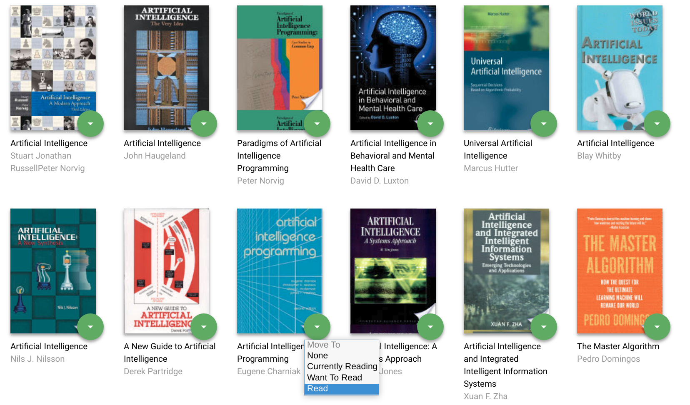
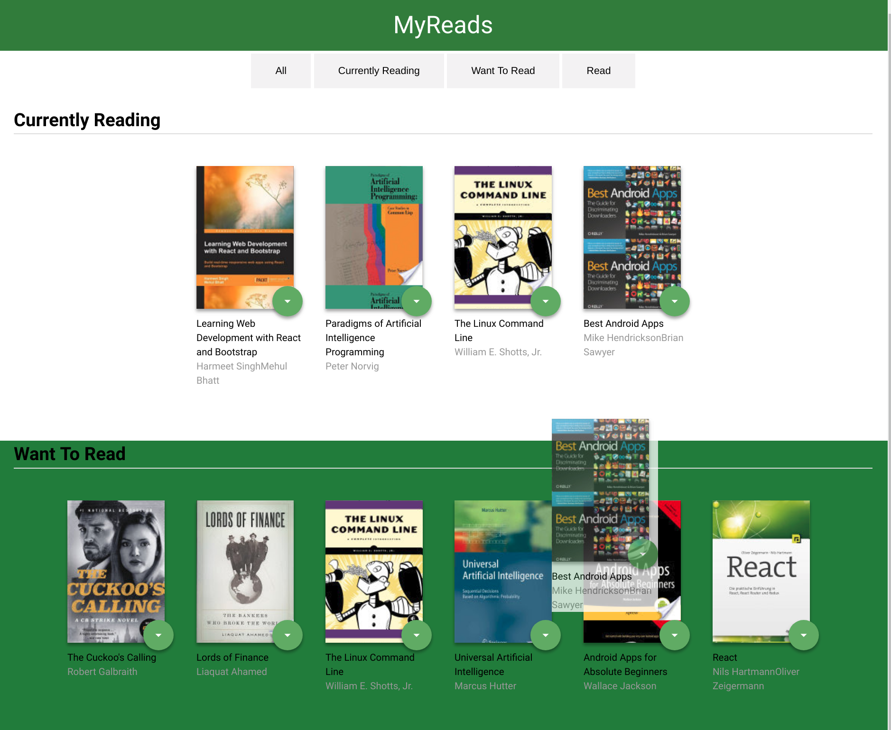
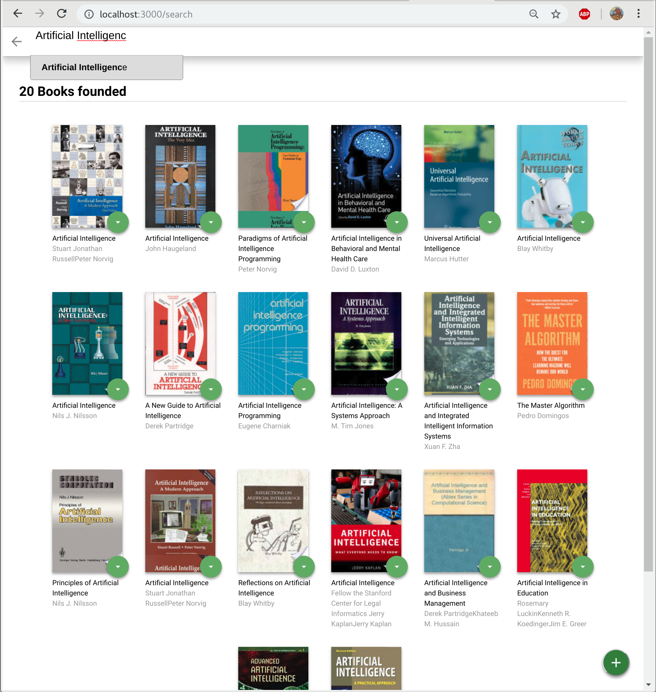

# MyReads Project

## Project Purpose

This project was built for the **Nanodegree React Developer**. The purpose of this project is to implement an application in React demonstrating knowledge and understanding about the structure of a React application in addition to using good programming practices in the implementation. The application consists of a bookcase that allows you to select and sort books into categories.

## Installing and loading the App

To run the project it is necessary to have installed the Node> = 8.x and the package manager npm.

To clone and install the project dependencies, in the terminal use the commands:
```bash
   git clone https://github.com/chroniu/reactnd-project-myreads-starter.git
   cd reactnd-project-myreads-starter
   npm install
```

With the dependencies installed, just go to the project folder and type in the terminal:
```bash
   npm start
```

The application server will be initialized and the application will be accessible at the address given in the output of the previous command. Usually it will be accessible at: [http://localhost:3000].

## Instructions

The application allows you to sort books into 3 categories:
- Currently Reading
- Want to Read 
- Read

There are 2 ways to modify a book category:

- Using the select menu as shown in the image below.




- Drag/Drop

Selecting and dragging a book from one category to another. This feature can only be used on the application's home screen.




To add a new book, just click the green button in the lower right corner of the page and type the search term or select any on the suggestions.




## Important
The backend API uses a fixed set of cached search results and is limited to a particular set of search terms, which can be found in [SEARCH_TERMS.md](SEARCH_TERMS.md).


## Extra libraries 

This project used the following libraries:
 - react-autosuggest: to show search suggestions
 - autosuggest-highlight: to improve the user experience in viewing search suggestions.
 
